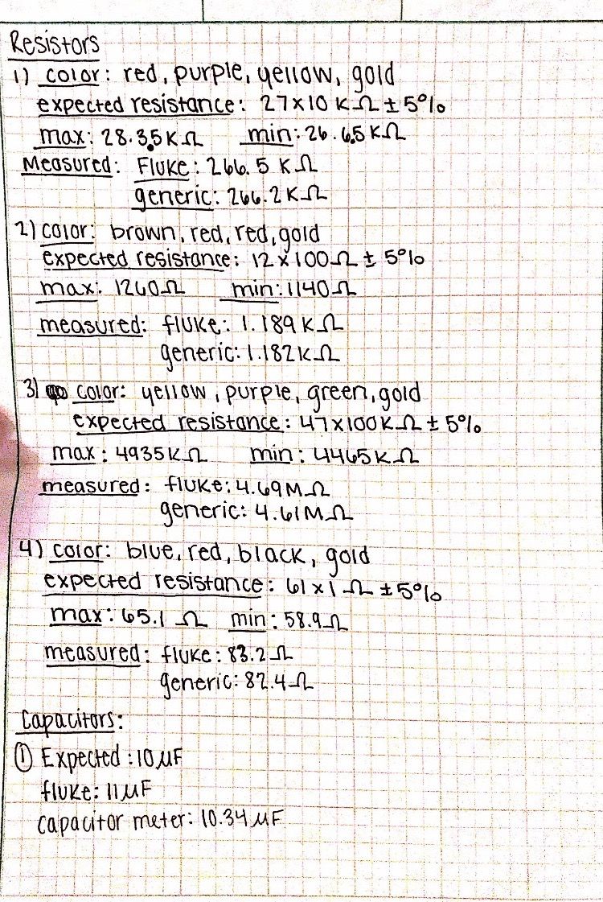
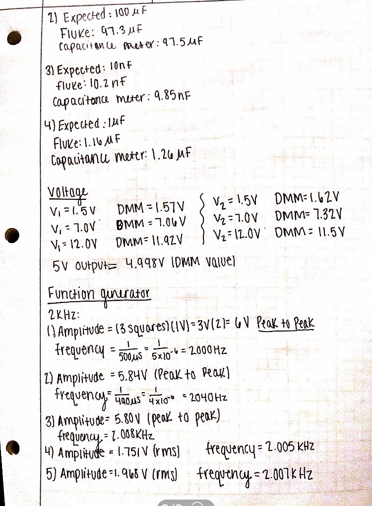

# BAE-305-Sp19-Lab1
# Lab 1 - Well-Equipped

# By: Courtney Conklin
# Summary
The goal of this lab was to become familiar with how to use multiple pieces of electronic equipment that will be incorporated into other labs this semester. The equipment that was used included the Digital Multimeter, an Oscilloscope, a Function Generator, and a Direct Current Power Supply. The Fluke and the generic Digital Multimeters were used to measure the resistance of different resistors and the capacitance of different capacitors. The voltage of the Direct Current Power supply were measured and verified. The function generators' output was measured by determining the amplitude and frequency of sine waves. The final goal of this lab was to learn how to use Github for team collaboration and lab report submission in the future. 
# Materials
* Resistors
* Capacitors
* Cables 
* Proto Board 
# Assembly Procedures
1. Summarized the color code of each resistor, the expected resistance, and determined the maximum and minimum values of the resistor from the expected resistance. 
2. Determined the expected values for each of the four capacitors. 
3. Plugged in the Direct Current Power Supply and became familiar with its controls. 
4. Set the output of V1 and V2 on the D.C Power Supply to the following voltages: 1.5V, 7.0V, and 12.0V. 
5. Created a circuit using the cables, the proto board, the function generator, and the oscilloscope in order to produce a 2kHz sine wave with maximum amplitude on the oscilloscope. 

# Test Equipment
* Generic Digital Multimeter 
* Fluke Digital Multimeter 
* Oscilloscope 
* Function Generator 
* Direct Current Power Supply 
# Test Procedures
1. Determined the actual resistance for each of the four resistors by using the Fluke and Generic DMM. 
2. Measured the capacitance for each of the four capacitors by using the Fluke DMM and  capacitance meter. 
3. Measured the value of V1 at 1.5V, 7.0V, and 12.0V on the D.C power supply with the Digital Multimeter. 
4. Measured the value of V2 at 1.5V, 7.0V, and 12.0V with the Digital Multimeter.
5. Used the Digital Multimeter to measure the actual voltage of the 5.0V output. 
6. Measured the frequency and amplitude of the wave generated on the oscilloscope by counting the squares on the oscilloscope screen. Each square corresponded to 1V for the amplitude and 500 microseconds for the frequency. 
7. Measured the frequency and amplitude of the sine wave on the oscilloscope by using the movable cursor on the screen. 
8. Measured the frequency and amplitude of the wave by using the measurement feature on the oscilloscope. 
9. Measured the frequency and amplitude of the sine wave on the oscilloscope by using the Generic DMM and Fluke DMM. 
# Test Results

# Discussion
The measurements that were gotten from each of the electronic equipment overall had very similar values to the expected values with only a slight variation. The Fluke and generic DMMs measured resistances that were within range of the calculated resistance values from the color band. The measured voltages from the DMMs on the D.C power supply were close to the voltage readings on the actual D.C power supply. Based on the data from the experiment, all of the instruments agreed with each other and the expected values. The lab successfully allowed for practice on using the equipment and becoming familiar with all of it.  
